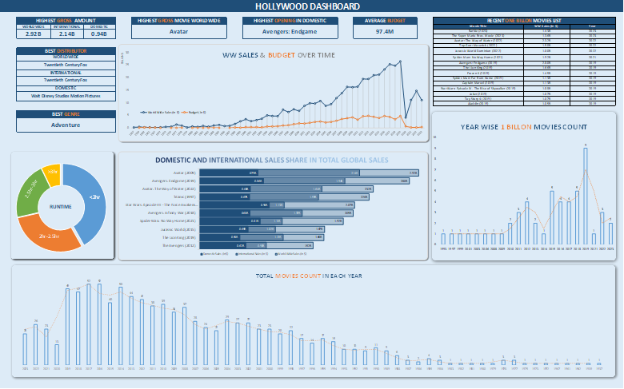
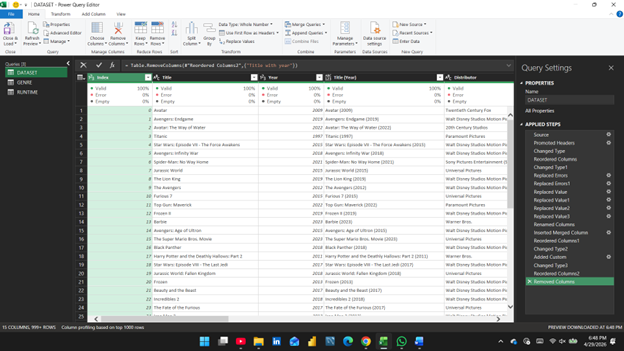

# 🎬 Hollywood Box Office Analytics Dashboard – Excel | Power Query

This project is an end‑to‑end **Hollywood Box Office Analytics Dashboard** built using Excel and Power Query.  
It analyzes worldwide, domestic, and international movie revenues, budgets, genres, distributors, and runtime trends for the highest‑grossing Hollywood films.

Dataset Source/Credit:  
Custom curated dataset based on publicly available box‑office records.

---

## 📊 Project Overview
The goal of this project was to transform raw Hollywood movie data into a fully interactive dashboard that supports:
- Worldwide, domestic, and international revenue analysis  
- Budget vs revenue performance  
- Runtime distribution insights  
- Genre and distributor performance  
- Billion‑dollar movie trends  
- Year‑wise movie release patterns  

The final dashboard provides a clear, executive‑level view of global box‑office performance.

---

## 🧩 Data Model
The dataset includes the following fields:
- **Title**
- **Year**
- **Distributor**
- **Budget**
- **Domestic Opening**
- **Domestic Sales**
- **International Sales**
- **Worldwide Sales**
- **Genre**
- **Running Time**
- **License**
- **Movie Info**

Power Query transformations included:
- Promoting headers  
- Changing data types  
- Removing unnecessary columns  
- Replacing errors  
- Standardizing distributor and genre fields  
- Creating runtime groups (<2 hr, 2–2.5 hr, 2.5–3 hr, >3 hr)  

---

## 🔧 Tools & Techniques
- **Excel** (Dashboarding, PivotTables, Slicers)
- **Power Query** (Data cleaning, merging, transformations)
- **Data Modeling** (Structured tables, relationships)
- **Data Visualization** (Bar charts, line charts, pie charts, KPI cards)
- **ETL Automation** (Refreshable Power Query pipeline)

---

## 📈 Key Insights
- **Avatar** is the highest‑grossing movie worldwide at **$2.928B**  
- International markets contribute **60–75%** of total revenue for most blockbusters  
- Average movie budget is approximately **$97M**  
- Most billion‑dollar movies fall between **2–3 hours** of runtime  
- Disney, Universal, and Warner Bros dominate global distribution  
- Strong revenue peaks observed around **2015** and **2019**, with recovery in **2022–2023**

---

## 📊 Dashboard Preview

## 🔧 Power Query Workflow

---

## 📬 Contact
If you have questions or want to discuss this project, feel free to reach out:
- [LinkedIn](https://www.linkedin.com/in/nikhilkattaguri)  
- [Email](mailto:nikhilkattaguri27@gmail.com)
